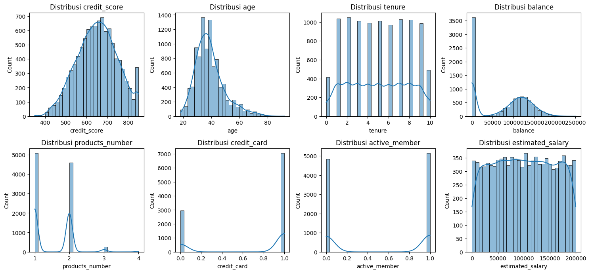
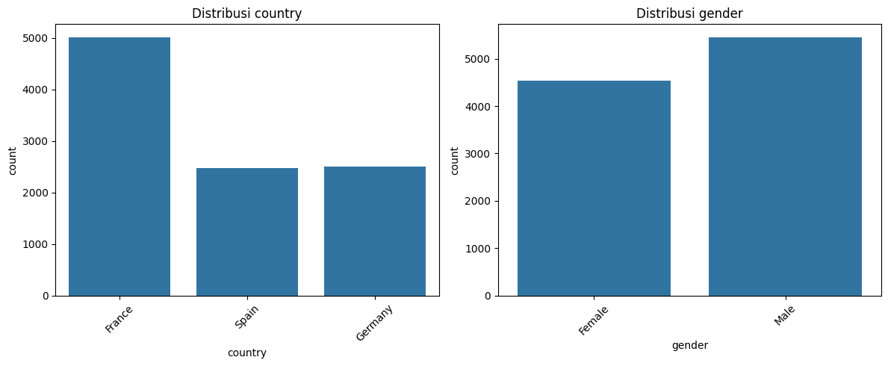
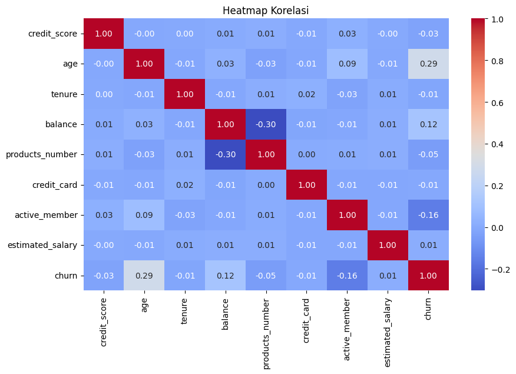
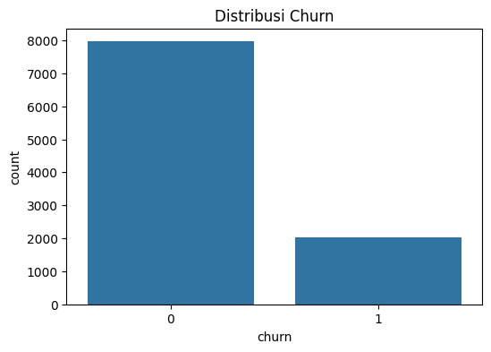

# Laporan Proyek Machine Learning - Thomas Dito Rigorastio

## Domain Proyek
Topik yang diangkat dari proyek ini yaitu mengenai bidang ekonomi dan bisnis, di mana suatu perusahaan perbankan ingin melakukan identifikasi terhadap pengguna yang churn.

### Latar Belakang
Dalam dunia perbankan dan layanan keuangan, churn atau hilangnya pelanggan merupakan tantangan utama yang dapat berdampak signifikan terhadap profitabilitas perusahaan. Oleh karena itu, perusahaan ingin mengetahui faktor-faktor yang mempengaruhi churn pelanggan agar dapat mengambil langkah strategis untuk meningkatkan retensi pelanggan dan mengoptimalkan layanan mereka.

Beberapa studi menunjukkan bahwa model machine learning dapat membantu dalam memprediksi churn dengan tingkat akurasi yang tinggi, memungkinkan perusahaan untuk mengambil langkah-langkah preventif guna mempertahankan pelanggan.

Referensi: [Customer Churn Prediction Using Machine Learning](https://scholar.google.com/)

## Business Understanding

### Problem Statements
1. Bagaimana cara mengidentifikasi pelanggan yang memiliki kemungkinan tinggi untuk churn?
2. Faktor apa saja yang berkontribusi terhadap keputusan pelanggan untuk berhenti menggunakan layanan bank?
3. Bagaimana cara meningkatkan performa model prediksi churn agar lebih akurat dan dapat digunakan secara efektif?

### Goals
1. Membangun model machine learning yang dapat memprediksi churn pelanggan berdasarkan fitur yang tersedia dalam dataset.
2. Menganalisis faktor-faktor utama yang memengaruhi churn pelanggan menggunakan teknik eksplorasi data.
3. Meningkatkan performa model menggunakan teknik **hyperparameter tuning** agar mendapatkan prediksi yang lebih akurat.

### Solution Statements
Solusi yang dapat dilakukan untuk memenuhi goals proyek ini diantaranya sebagai berikut:
- Membuat model Machine Learning menggunakan algoritma **Random Forest Classifier** untuk memprediksi churn pelanggan.

  * Konsep dari algoritma **Random Forest** adalah model prediksi yang terdiri dari beberapa pohon keputusan dan bekerja secara bersama-sama untuk meningkatkan akurasi dan mengurangi overfitting[[1]](https://www.revou.co/kosakata/random-forest). 

    

  Kelebihan dari metode ini adalah:
  - Dapat menangani dataset besar dengan banyak fitur.
  - Tidak rentan terhadap overfitting dibandingkan dengan decision tree tunggal.
  - Dapat digunakan untuk fitur numerik maupun kategorikal.

  Kekurangan dari metode ini adalah:
  - Model lebih kompleks dan membutuhkan lebih banyak sumber daya komputasi dibandingkan model linear.
  - Interpretasi hasil lebih sulit dibandingkan dengan model yang lebih sederhana seperti Logistic Regression.

- Model akan dievaluasi menggunakan metrik **Accuracy, Precision, Recall, dan F1-score** untuk memastikan model bekerja dengan baik. **Precision dan Recall sangat penting dalam konteks churn karena kita ingin memastikan pelanggan churn dapat terdeteksi dengan baik**.

## Data Understanding

Dataset yang digunakan dalam proyek ini adalah **Bank Customer Churn Prediction Dataset**. Dataset ini berisi informasi pelanggan yang mencakup data demografis, aktivitas perbankan, dan status churn.

Dataset ini dibuat oleh [Gaurav Topre](https://www.kaggle.com/gauravtopre) yang di upload ke [Kaggle](https://www.kaggle.com/) dengan dataset Bank Customer Churn yang memiliki jumlah data sebesar 10000 baris dan 12 kolom

Sumber Dataset: [Kaggle: Bank Customer Churn Dataset](https://www.kaggle.com/datasets/gauravtopre/bank-customer-churn-dataset)

### Variabel dalam Dataset
- **customer_id**: ID unik pelanggan
- **credit_score**: Skor kredit pelanggan
- **country**: Negara tempat pelanggan terdaftar
- **gender**: Jenis kelamin pelanggan
- **age**: Usia pelanggan
- **tenure**: Lama menjadi pelanggan dalam tahun
- **balance**: Saldo pelanggan di bank
- **products_number**: Jumlah produk yang digunakan pelanggan
- **credit_card**: Status kepemilikan kartu kredit (1 = Ya, 0 = Tidak)
- **active_member**: Status keaktifan pelanggan (1 = Aktif, 0 = Tidak Aktif)
- **estimated_salary**: Perkiraan gaji pelanggan
- **churn**: Status churn pelanggan (1 = Churn, 0 = Tidak Churn)

### Kondisi Data
- Jumlah Baris dan Kolom:
  - Dataset memiliki 12 kolom dengan detail seperti yang telah disebutkan di atas pada sub-bab 'Variabel dalam Dataset'
  - Dataset memiliki total 10 ribu baris
- Missing Value:
  - Tidak terdapat missing value pada dataset
- Duplikasi Data:
  - Tidak terdapat duplikasi data pada dataset
- Parameter Statistik:
  - Ringkasan parameter statistik dari dataset pun, tergolong cukup normal dan tidak terlihat adanya indikasi inaccurate value
- Kesimpulan:
  - Secara kesluruhan, dataset sudah sangat bersih dan tidak terdapat "kecacatan" data seperti missing value dan duplikasi data, dengan 12 kolom dan 10 ribu baris.

### Exploratory Data Analysis
1. Plot distribusi data untuk kolom numerik

Insight dari hasil visualisasi di atas:
- Credit_score cendrung berbentuk normal, memiliki arti bahwa tidak ada ketimpangan dalam skor kredit pelanggan.
- Age memiliki puncak di usia tertentu, memiliki arti bahwa mayoritas pelanggan berada dalam rentang usia itu.
- Ada banyak pelanggan dengan saldo nol, ini bisa menjadi perhatian, karena pelanggan dengan saldo rendah cenderung churn.
- Pada estimated salary terlihat distribusi merata, memiliki arti bahwa gaji pelanggan tersebar luas dan tidak terfokus pada rentang tertentu

2. Plot distribusi data untuk kolom kategorik

Insight dari hasil visualisasi di atas:
- Ada negara yang mendominasi (lebih banyak pelanggan dari Prancis), ini bisa memengaruhi keputusan segmentasi.
- Jika negara tertentu memiliki lebih banyak pelanggan churn, bisa ada faktor spesifik yang menyebabkan hal ini.
- Tidak ada perbedaan signifikan antara jumlah pria dan wanita, kemungkinan gender tidak terlalu mempengaruhi pelanggan yang churn.

3. Heatmap korelasi kolom numerik

Insight dari hasil visualisasi di atas:
- Dari hasil heatmap korelasi ini, terlihat bahwa ada beberapa kolom yang memiliki korelasi dengan churn yang menjadi target dari klasifikasi
- Age memiliki korelasi sedikit tinggi dengan churn, faktor ini mungkin menjadi penentu churn.
- Balance tidak berkorelasi kuat, saldo mungkin bukan faktor utama churn.
- Products_number berkorelasi negatif dengan churn, artinya semakin banyak produk yang dimiliki pelanggan, semakin kecil kemungkinan mereka churn.

4. Plot distribusi kolom churn (target)

Insight dari hasil visualisasi di atas:
- terlihat jumlah pelanggan yang tidak churn masih sangat jauh lebih banyak dibandingkan yang churn
- ini menunjukan masih banyak pelanggan yang menggunakan jasa dari bank ini, namun tetap aware terhadap pelanggan yang churn
- Jika jumlah churn sangat kecil, model prediksi bisa sulit belajar karena ketidakseimbangan data.

## Data Preparation

### Teknik Data Preparation yang Dilakukan:
1. **Label Encoding** pada kolom kategorik (`country`, `gender`) untuk mengubah data kategorik menjadi numerik.
2. **Normalisasi menggunakan MinMaxScaler** pada semua fitur numerik agar nilai berada dalam rentang yang seragam.
3. **Splitting Data** menjadi **training set (80%)** dan **testing set (20%)** untuk melatih dan menguji model.

## Modeling
### Model
Pada tahap ini, digunakan algoritma **Random Forest Classifier** karena mampu menangani dataset dengan fitur numerik dan kategorik, serta memiliki keunggulan dalam mengatasi overfitting dibandingkan dengan decision tree.

Random Forest adalah algoritma machine learning berbasis ensemble learning, yang menggabungkan beberapa Decision Tree untuk meningkatkan akurasi dan stabilitas model. Konsep utama dari Random Forest adalah membangun banyak pohon keputusan secara acak dan menggabungkan hasilnya untuk membuat prediksi yang lebih akurat dan mengurangi overfitting.

Detail pada model baseline:

- Model pertama dibangun tanpa hyperparameter tuning menggunakan **Random Forest Classifier** dengan parameter default.
- Evaluasi awal dilakukan untuk mengidentifikasi baseline performance.

### Hyperparameter Tuning
Hyperparameter tuning dilakukan untuk mengatasi kelemahan pada model baseline. Kelemahan yang terjadi pada baseline yaitu kecurigaan terjadinya sedikit overfitting. Maka dari itu, tuning dengan hyperparameter dilakukan dengan detail sebagai berikut:
- Model dituning menggunakan **GridSearchCV** untuk menemukan kombinasi parameter terbaik.
- **Parameter yang Digunakan dari Hasil GridSearchCV:**
  - `max_depth=20`
  - `min_samples_leaf=2`
  - `min_samples_split=10`
  - `n_estimators=100`
- Model ini lebih optimal dalam mengurangi overfitting dan meningkatkan akurasi dibandingkan model dasar.

### Parameter yang Digunakan pada Model Final:
- `max_depth=20` → Membatasi kedalaman pohon untuk menghindari overfitting
- `min_samples_leaf=2` → Mencegah cabang pohon yang terlalu kecil
- `min_samples_split=10` → Memastikan pembagian cabang pohon cukup representatif
- `n_estimators=100` → Menggunakan 100 pohon dalam ensemble

Setelah ditemukan kombinasi hyperparameter terbaik, model final kemudian juga diuji menggunakan keempat metriks evaluasi yang sama seperti pada baseline model, accuracy, precision, recall, dan f1-score. Dari hasil evaluasi, didapati bahwa terjadi peningkatan nilai accuracy dan precision yang akan di bahas pada bagian 'Evaluation' di bawah. Kemudian indikasi overfitting juga sudah lumayan tertangani, di mana hasil evaluasi pada data latih sudah tidak rata 100% dan juga hasil evaluasi pada data uji meningkat. Hal ini membuktikan bahwa pelakuan tuning pada model ini cukup efektif dan memberikan peningkatan performa.

## Evaluation

Metrik evaluasi yang digunakan dalam proyek ini adalah:
- **Accuracy**: Mengukur persentase prediksi yang benar dari total data.
- **Precision**: Mengukur seberapa banyak prediksi churn yang benar-benar churn.
- **Recall**: Mengukur seberapa baik model dalam menangkap semua pelanggan yang churn.
- **F1-score**: Rata-rata harmonik antara precision dan recall, berguna ketika data tidak seimbang.

### Hasil Evaluasi Model:
| Metrik  | Training Set (Sebelum Tuning) | Testing Set (Sebelum Tuning) | Training Set (Setelah Tuning) | Testing Set (Setelah Tuning)  |
|---------|------------------------------|-----------------------------|------------------------------|------------------------------|
| Accuracy | 1.0000 | 0.8640 | 0.9243 | 0.8665 |
| Precision | 1.0000 | 0.7824 | 0.9499 | 0.8070 |
| Recall | 1.0000 | 0.4594 | 0.6632 | 0.4521 |
| F1-score | 1.0000 | 0.5789 | 0.7811 | 0.5795 |

Hasil evaluasi menunjukan bahwa tuning hyperparameter meningkatkan sedikit performa model, khususnya pada accuracy dan precision yang meningkat cukup baik dengan nilai keduanya di atas 80%, yang berarti model mampu mengenali pelanggan churn dan non-churn dengan baik secara umum atau keseluruhan. Dari hasil evaluasi, model setelah tuning memiliki **akurasi yang tinggi (86.65%)**, hal ini menunjukan bahwa model mampu mengenali pelanggan churn dan non-churn dengan baik secara umum. Kemudian nilai **precision juga cukup baik (81%)**, hal tersebut bagus karena jika precision tinggi, maka kesalahan false positive lebih rendah, sehingga memiliki bisa diartikan bahwa pelanggan yang diprediksi churn memang lebih mungkin churn. Namun recall masih cukup rendah (45.21%), hal ini menunjukkan bahwa model lebih cenderung memprediksi pelanggan tetap bertahan dibandingkan memprediksi pelanggan churn. Terakhir pada hasil F1-score, model memiliki bobot senilai 58% yang menunjukkan bahwa model cukup baik, tapi recall masih bisa ditingkatkan.

Dari hasil penjelasan di atas, dapat disimpulkan bahwa model memiliki akurasi dan precision tinggi, yang bisa diartikan bahwa model cukup baik dalam memprediksi pelanggan churn dengan tingkat kesalahan rendah.

Untuk meningkatkan performa model, beberapa rekomendasi pendekatan yang bisa dicoba sebagai berikut:
- Menyesuaikan **threshold** untuk meningkatkan recall.
- Menggunakan **teknik balancing dataset** seperti SMOTE jika diperlukan.
- Mencoba model lain seperti **XGBoost atau Logistic Regression** untuk membandingkan performa.

### Dampak Model terhadap Business Understanding
- Model yang dibangun telah menjawab setiap **problem statement** yang diajukan dengan mengidentifikasi pelanggan churn:
  1. Bagaimana cara mengidentifikasi pelanggan yang memiliki kemungkinan tinggi untuk churn?
      - Pembangunan model menggunakan algoritma random forest sudah dilakukan untuk menjawab pertanyaan ini.

  2. Faktor apa saja yang berkontribusi terhadap keputusan pelanggan untuk berhenti menggunakan layanan bank?
      - Dari hasil EDA, kolom `age` memiliki puncak di usia tertentu, berarti mayoritas pelanggan berada dalam rentang usia itu, sehingga dapat menjadi faktor penentu.
      - Pada kolom `balance`, terdapat banyak pelanggan dengan saldo nol, ini bisa menjadi faktor penentu, karena pelanggan dengan saldo rendah cenderung churn.
      - pada kolom kategorik, spesifiknya `country`, mayoritas pelanggan berada di negara perancis. Sehingga, kolom ini juga bisa menjadi faktor yang berkontribusi terhadap churn.

  3. Bagaimana cara meningkatkan performa model prediksi churn agar lebih akurat dan dapat digunakan secara efektif?
      - Metode tuning dengan hyperparameter dilakukan untuk mendapatkan hasil prediksi yang lebih akurat
      - Metode GridSearchCV juga dilakukan untuk mencari kombinasi hyperparameter terbaik untuk meningkatkan akurasi

- **Goals proyek sebagian besar telah tercapai**, terutama dalam membangun model prediksi dan memahami faktor utama churn.
  1. Membangun model machine learning yang dapat memprediksi churn pelanggan berdasarkan fitur yang tersedia dalam dataset:
      - Model telah dibangun menggunakan algoritma random forest dengan evaluasi metriks accuracy sebesar 86.40% sebagai model baseline.

  2. Menganalisis faktor-faktor utama yang memengaruhi churn pelanggan menggunakan teknik eksplorasi data:
      - Tahapan proses EDA telah dilakukan untuk mencari tahu dan menganalisis faktor-faktor apa saja yang mempengaruhi churn.

  3. Meningkatkan performa model menggunakan teknik **hyperparameter tuning** agar mendapatkan prediksi yang lebih akurat:
      - Metode tuning dengan hyperparameter dilakukan untuk mendapatkan hasil prediksi yang lebih akurat
      - Metode GridSearchCV juga dilakukan untuk mencari kombinasi hyperparameter terbaik untuk meningkatkan akurasi

- **Solusi statement yang direncanakan berdampak**, karena model memberikan wawasan bisnis untuk strategi retensi pelanggan:
  1. Membuat model Machine Learning menggunakan algoritma **Random Forest Classifier** untuk memprediksi churn pelanggan:
      - Model algoritma random forest telah dibangun dan ditingkatkan akurasinya menggunakan hyperparameter tuning untuk memprediksi churn.

  2. Model akan dievaluasi menggunakan metrik **Accuracy, Precision, Recall, dan F1-score** untuk memastikan model bekerja dengan baik:
      - Evaluasi pada model telah dilakukan dengan keempat metriks evaluasi yang disebutkan. Hasil evaluasi pada baseline model dan setelah tuning juga telah dibandingkan untuk melihat perbedaan dan peningkatan akurasinya.

